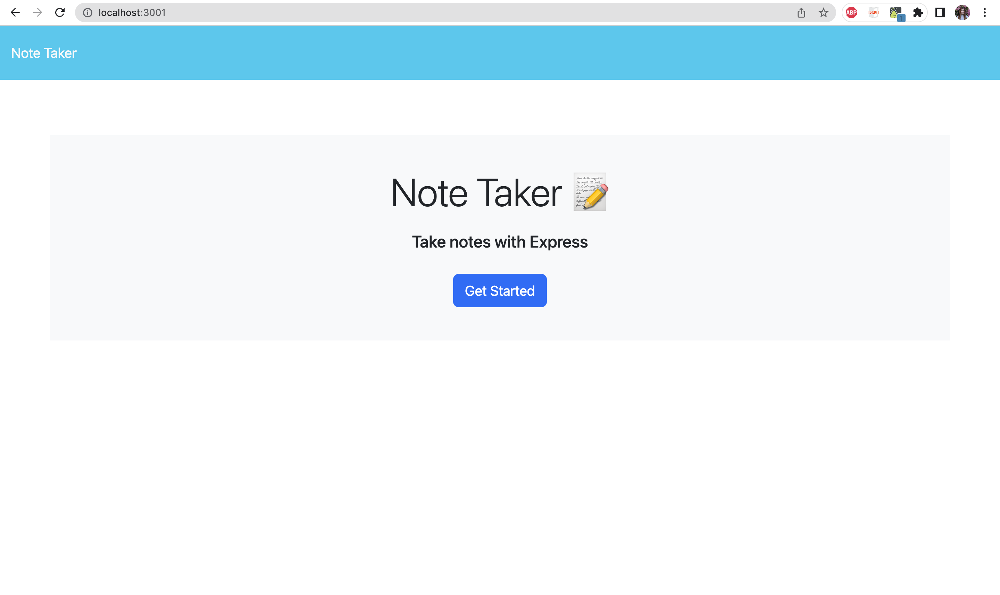
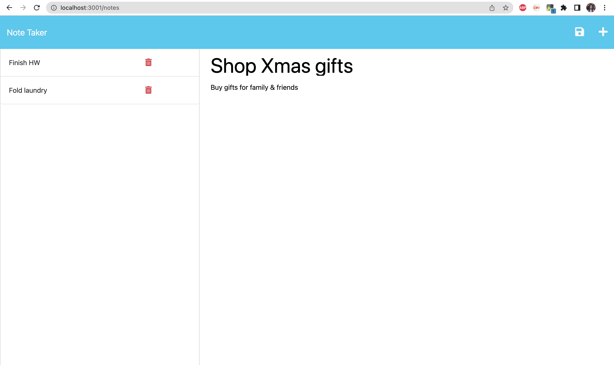

# Note Taker
## Description

This application is built for users to write, save and delete notes as needed so that they can organize their thoughts and keep track of tasks to complete.

## Table of Content

* [Installation](#installation)

* [Usage](#usage)

* [Contributing](#contributing)

* [Questions](#questions)   

## Installation

To install all necessary dependencies for development purposes, please run the command below:
``npm i express``
``npm run start``

## Usage

To use this application, open the Note Taker by going to [http://localhost:3001/](http://localhost:3001/). Click on the Get Started button to be taken to the Note Taking page. Then, type in the note title and text describing the task to complete. Once both fields are filled out, a Save icon will appear on the right hand side and can be clicked to save the note. Saved notes will appear on the left-hand column and can be fully viewed again when clicked on. To write more notes, click on the Plus icon at the top right corner. Notes can also be deleted by clicking on the Trash icon for each note.
 

  

  

## Contributing

There are many ways in which you can participate in this project.
Users can contribute to this repo by submitting bugs and feature requests, reviewing source code changes, and making pull requests for any issues they can find.    

## Questions

For any questions or feedback, please feel free to email me at nbtrieu@uci.edu.
If you would like to check out more of my projects, please visit [nbtrieu](https://github.com/nbtrieu).

